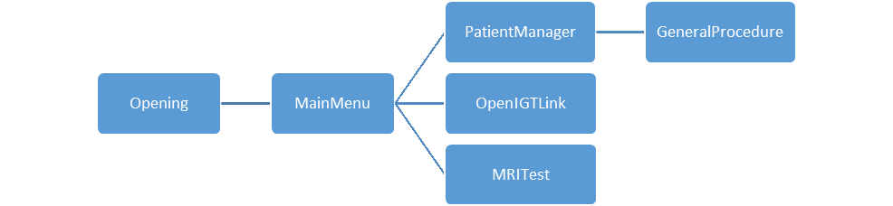

# QuickNav Assets
## HoloLensXboxControllerInput

   <https://assetstore.unity.com/packages/tools/input-management/xbox-controller-input-for-hololens-70068>  
   Contains plugins that allow you to connect to the Xbox controller. Use the example script as a reference for using the plugin in your own script.

## HoloToolKit

   <https://github.com/Microsoft/MixedRealityToolkit-Unity>  
   Contains prefabs for cursors and the HoloLens camera, as well as the input manager which is used for AirTap and Gaze control and background stability control.

## OBJImport

   <https://assetstore.unity.com/packages/tools/modeling/runtime-obj-importer-49547>  
   Contains script used to load .obj files as meshes into the scene.

## HoloQuickNav (assets created in the lab)
### Models
#### Anatomy
   Contains models and .csv files containing fiducial points for old phantom models used in previous demos and testing. Can be removed if not needed, models are on the P:\ drive if ever needed in the future. Also contains material assets for skin, brain, and hematoma.

#### Menus
   Contains material assets for menus such as backgrounds, buttons, and menu selectors. Also contains sprite assets for Xbox button symbols and the Perk Lab logo.
   
#### MRI
   Contains MRI slices from testing for volume rendering. Can be removed or used for future testing. 
   
#### Tools
   Contains models for arrows used in various translating and rotating tools. Also contains materials for these models as well as the axes shown during rotation and translation.
   
### Scripts
#### 3PointReg_old
   Contains all scripts related to original 3 point registration. Can be deleted if not needed anymore. 

#### FileBrowser
   Contains all scripts used in the PatientManager to access patient data stored in QuickNav’s LocalState file. These scripts are used to load the models into the scene, rename them and apply the appropriate materials.
   
#### GazeTools
   Contains scripts for old tools that relied on the user’s gaze and head movement, including translation, rotation, and a newer version of the point registration. MoveWithHead and DepthWithHead were used in combination to move the model freely and have control over its position in all 3 dimensions.
   
#### IGTLink
   Contains script to control the UI that displays the information that has been loaded from Slicer through an .xml. Also contains ReadXml script which is used in both the PatientManager and OpenIGTLink scenes to read the patient’s .xml file.

#### Input
   Contains scripts for handling AirTap, Gaze, and Xbox controller input. Attach these objects to the tools/objects that you want to manipulate and add Unity Events to each input in the Unity Editor.
   
#### MenuControl
   Contains scripts to be attached to menus and text in the scene so that they are positioned correctly and facing the user.

#### MRI
   Currently only contains a test script for scrolling through a set of MR images. This will likely not be needed if we intend on using 3DVolumes instead.
   
#### SceneManagement
   Contains scripts for initializing scenes, swapping between scenes, and controlling various components or tools in a scene. Also contains WriteLog which is a script that can be used to track a user’s process while they use the program, and also as a debugger during testing.
   
#### XboxTools
   Contains scripts for translation and rotation tools using the Xbox controller.
   
### Scenes

## Scene Structures
### Opening
* Displays Perk Lab logo for 3 seconds before swapping scenes to MainMenu
* InputManager game object contains QuickNavManager, which scene management scripts are attached to
* WriteLog script is initialized in this scene and DoNotDestroy() is applied so that it continues to exist during all future scene changes, therefore can be accessed at any point for debugging purposes

### MainMenu
* Gives the option to load patient data from Slicer through the OpenIGTLink scene, or load existing data using the file browser in the PatientManager scene
* InputManager game object contains QuickNavManager, which scene management scripts are attached to
* Initializes scene by destroying any existing models that may have been previously loaded from the PatientManager, ensures that only one patient’s models are loaded into the scene at once
* Menu navigation relies on XboxMenuController script, scene swapping events are then selected in the UnityEditor for the corresponding buttons

### PatientManager
* Loads all files in the LocalState/PatientData folder in the App data and allows the user to navigate through the folders and files to select a patient 
* Once a patient is selected, the .xml is read to store location values and models are created from the .obj files 
* The models for the patient are then displayed to the user to ensure they have loaded correctly and the user has selected the correct patient
* If it is the correct patient, the user then loads the model into another scene for the registration process
   * This is currently the GeneralProcedure scene, but more sets of tools will be developed in the future which will require multiple scenes
   * The scene the model is loaded into is chosen by reading the procedure type in the .xml
* If the model loaded is incorrect, the user can select another patient. Any existing models are destroyed and the new models are loaded and displayed to the user
* InputManager game object contains QuickNavManager, which scene management scripts are attached to
* MaterialManager (under QuickNavManager) is used to carry materials that can be accessed when the models are loaded 
   * Used because Assets cannot be accessed at runtime, so they must be stored somewhere within the application 
   * Additional materials can be added within this script in the future for other applications
* LoadedModels is the game object which is not destroyed between scene changes
   * It contains the LocationValues component to store point coordinates read from the .xml, as well as any models created from the file browser
   * This game object carries all patient data and models into whichever procedure/scene is used for registration 
   
### OpenIGTLink
* Currently only half setup, will eventually be used as a UI when connecting to Slicer
   * First thing sent from Slicer will be an .xml
   * The UI on the HoloLens will parse the .xml and display all the provided information to the user to verify it has been received properly
   * Using the .xml procedure type and patient ID, a folder will be created in the file browser for the rest of the patient data/models to be saved in
   * The UI will list which models are expected from Slicer and their load status (if they’ve been successfully saved in the patient folder)
   * As the remaining data/models are sent from Slicer, the load statuses will be updated 
* Once the user confirms all patient data has been saved, they can access the PatientManager scene to load the models for registration
* InputManager game object contains QuickNavManager, which scene management scripts are attached to
* FileMenu game object contains all text and backgrounds
* Currently relies on a hardcoded file path written in ReadXml.Start() to test reading in the .xml from the SDH demo
* The update load status method in ModelLoaderMenu is also currently linked to an Xbox control in the scene for testing, but in future will need to be done automatically to update after data has been received

### GeneralProcedure
* Used for clinical trials, provides basic registration tools
* Game Object Hierarchy
   * InputManager
      * Contains QuickNavManager, which scene management scripts are attached to
      * Initialize script in QuickNavManager takes care of 3 things to setup the scene
         * All models from PatientManager are children of LoadedModels, they are moved into WorldAnchor/Model/Layers to be used in the scene
         * The model is repositioned such that the tip of the nose is at (0, 0, 0) relative to the Layers game object, this is done using LocationValues script loaded from PatientManager and attached to LoadedModels
         * If any target locations are specified in the .xml and listed in LocationValues, the target prefab under WorldAnchor/Model/Layers/Targets is duplicated and positioned for each target coordinate
      * ComponentManager script in QuickNavManager controls all tools/menus/text in the scene
         * Each time a different tool is selected, all tools and menus are disabled and then the selected tool is enabled for use
      * The main Xbox control for the scene to switch between tools is located in QuickNavManager
    * WorldAnchor
       * Contains PlaceWorldAnchor script which creates an anchor at the start location of the model to help with stability of the holograms in the scene
       * The AxisR/A/S game objects under WorldAnchor/Model are visible when the rotation tool is in use
    * Controls
       * Home 
          * locks model in place
          * use right and left shoulder buttons on Xbox controller to open/close menu to turn layers on and off using DisplayLayers script 
          * when Home is first selected, all models are made visible by TurnOnLayers script
          * use right trigger on Xbox controller to take a picture
             * this uses MRC (Mixed Reality Capture) script which is still being used for testing
      * ShiftWithXbox
         * Contains axes game objects that are visible when shifting the models
         * Contains AxisPoints object which is used to position the axes in ShiftWithXbox script
      * RotateWithXbox
         * Simple tool, contains RotateWithXbox script
   * CommandText
      * Uses CommandText script to position the text mesh and symbols properly around model
   * Menu
      * Uses XboxMenuController and MenuBehaviour scripts to position menu properly and allow user to navigate it

### MRITest
* Simple scene used for previous testing
* Uses Xbox control to scroll through a set of MRI slices 

